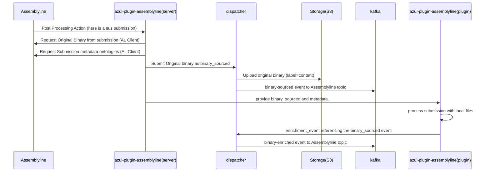

# Azul Plugin Assemblyline

Server that can receive Post Processing actions from Assemblyline and transform and forward the relevant submission data to Azul.

## Development Installation

To install azul-plugin-assemblyline for development run the command
(from the root directory of this project):

```bash
pip install -e .
```

## Usage

Cannot be used on local files because the assemblyline metadata file and original binary
need to be provided together.

Automated usage in system:

```bash
azul-plugin-assemblyline --server http://azul-dispatcher.localnet/
```

## Additional environment variables

The settings.py file lists out all environment variables that can be set for this plugin.
Note that some are set through the secret creation listed below.

## Kubernetes Secret creation

Currently this secret needs to be created manually the fields for doing so are as follows:

```bash
kubectl create secret generic -n=azul assemblyline-receiver \
  --from-literal al_user= <username-in-assemblyline> \
  --from-literal al_token= <token-in-assemblyline> \
```

The username can be found on the assemblyline UI when generating the token.
The token is generated on the assemblyline UI

## Operation of Plugin

azul-plugin-assembyline is split into two parts a server and a plugin, it's plugin
doesn't get jobs from dispatcher like a normal plugin.

Instead it accepts a POST request from Assemblyline's PostProcessingAction and upon receiving
the request it:

1. downloads the original binary file from Assemblyline
1. downloads the assemblyline metadata associated with the submission from assemblyline.
1. finds the maximum classification associated with the submission and metadata and sets that as the Azul classification.
1. generates and submits the raw original binary file as a binary_sourced event to Azul.
1. run the azul-assemblyline plugin providing it the generated binary_sourced event and the original binary file along with the assemblyline metadata as local file streams.
1. the plugin then processes this data and posts and enrichment event to dispatcher like a normal plugin would.

The following diagram shows this process:

### azul-plugin-assemblyline Server (main.py) and plugin (plugin.py)



## Python Package management

This python package is managed using a `setup.py` and `pyproject.toml` file.

Standardisation of installing and testing the python package is handled through tox.
Tox commands include:

```bash
# Run all standard tox actions
tox
# Run linting only
tox -e style
# Run tests only
tox -e test
```

## Dependency management

Dependencies are managed in the requirements.txt, requirements_test.txt and debian.txt file.

The requirements files are the python package dependencies for normal use and specific ones for tests
(e.g pytest, black, flake8 are test only dependencies).

The debian.txt file manages the debian dependencies that need to be installed on development systems and docker images.

Sometimes the debian.txt file is insufficient and in this case the Dockerfile may need to be modified directly to
install complex dependencies.
